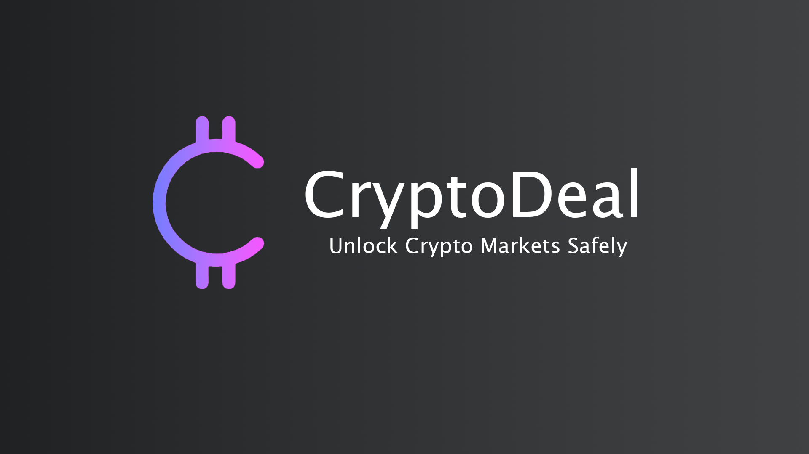

# CryptoDeal

* [About Cryptodeal](#aboutcryptodeal)
* [Demonstration](#demonstration)
* [Technologies Used](#technologies)
* [License](#license)

## About CryptoDeal

CryptoDeal is a real-time crypto trading simulator developed with Laravel, offers a dynamic platform where newcomers to crypto trading can acquire valuable skills and delve into market trends, while experienced traders can experiment with new ideas in a risk-free environment. With its user-friendly interface and integrated analytical tools, CryptoDeal provides a seamless experience for honing strategies and navigating the complexities of the cryptocurrency market.

## Technologies Used

Project is created with:
* Laravel
* PHP
* JavaScript
* HTML
* CSS
* QunatifyCrypto API

## License

CryptoDeal is open-sourced software licensed under the [MIT license](https://opensource.org/licenses/MIT).
